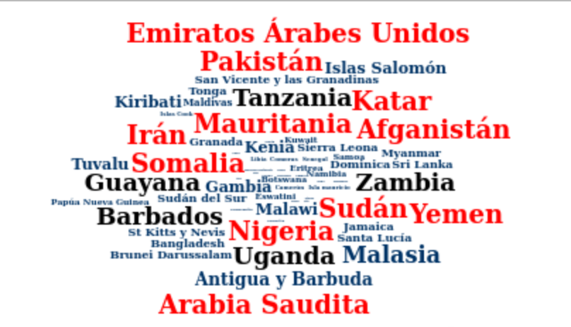

# Datos de miércoles semana 11

*20/06/19*

Semana del Orgullo LGBT :rainbow: 
Se trabajó sobre datos de legislación sobre orientación sexual. Pueden encontrar más información sobre los datos [aquí](https://github.com/cienciadedatos/datos-de-miercoles/tree/master/datos/2019/2019-06-19)

Yo enfoqué mi visualización sobre aquellos que penalizan la homosexualidad, y para ello construí una nube de palabras en los que se ven resaltados, con la fuente de mayor tamaño y en color rojo, los nombres de los países que contemplan la pena de muerte para castigar la homosexualidad, en negro se representarán aquellos que castigan con prisión perpetua, y el resto se verá su tamaño de acuerdo a los años de pena que prevé para ese "delito" :sad:

Librerías utilizadas:
- Readr
- Tidyverse
- Wordcloud2

Cargamos los datos con las siguentes líneas
>leyes <- readr::read_csv("https://raw.githubusercontent.com/cienciadedatos/datos-de-miercoles/master/datos/2019/2019-06-19/leyes.csv")

Trabajamos los datos:
>criminalizacionFreq <- leyes %>% 
  filter(criminalizacion==0) %>%
  select(pais_es, criminalizacion_pena) %>% 
  mutate(criminalizacion_pena= recode(criminalizacion_pena, "muerte (NOT)"= "22", "muerte (REG)"= "22", "muerte"= "22", "perpetua"= "21", "indeterminado"= "7")) %>% 
  mutate(criminalizacion_pena=as.integer(criminalizacion_pena)) %>% 
  rename(word= pais_es, freq=criminalizacion_pena) %>% 
  mutate(color = case_when(freq==22 ~ "red",
                           freq==21 ~ "black",
                           freq <21 ~ "#003366"))

Plasmamos en la nube de palabras:

>wordcloud2(criminalizacionFreq,
           color = criminalizacionFreq$color, size = .1, rotateRatio = 0, gridSize = 1)

